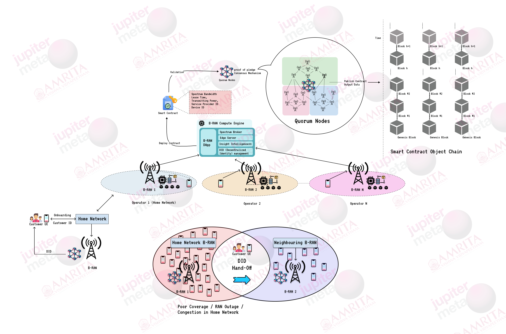

## Welcome to the 6G Spectrum Tokenization Project

This repository is part of a joint research initiative by **Jupiter Meta** and **Amrita Vishwa Vidyapeetham** aimed at revolutionizing spectrum management in 6G networks using blockchain technology.

### Research Objective:

- **Blockchain-based Spectrum Management:** Develop a decentralized spectrum management system for Radio Access Networks (RAN) to dynamically allocate spectrum resources.
- **Spectrum Tokenization:** Enable secure and detailed sharing of spectrum parameters, including frequency bands, lease durations, transmit power, and geolocation of secondary providers.
- **Compliance & Auditability:** Ensure all spectrum-sharing transactions comply with Service Level Agreements (SLA) and regulatory standards, with built-in reporting features for regulatory oversight.
- **Adaptive Blockchain Design:** Build a system that adapts to real-time network conditions and demand, enhancing Quality of Service (QoS) in 6G networks.
- **AI & Machine Learning Integration:** Utilize AI and ML to optimize spectrum allocation, ensuring efficient and precise resource management in dynamic environments.

### Architecture:

Explore the code, contribute, and help us shape the future of spectrum management for 6G networks!
